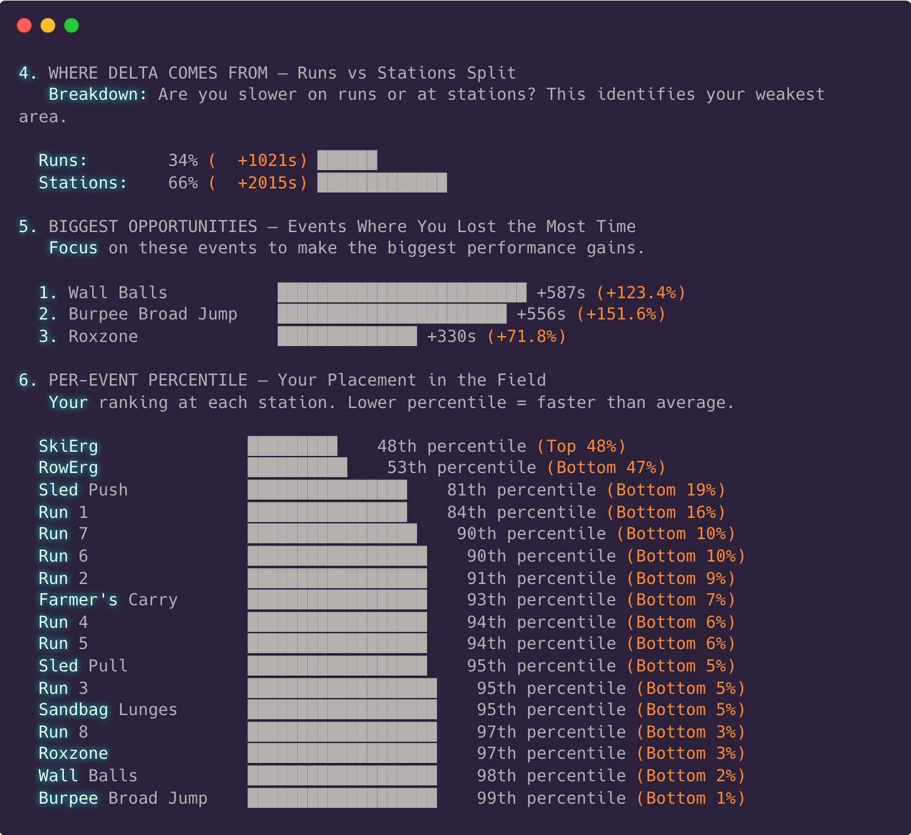
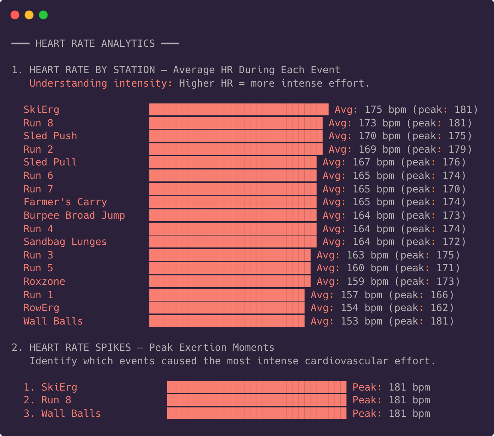

# Hyrox Race Insights


A terminal-based analytics tool that visualises your [Hyrox](https://hyrox.com/) race data, highlights strengths and weaknesses, and provides actionable insights to help you improve your time. Made possible thanks to the [Pyrox Client](https://github.com/vmatei2/pyrox-client/tree/main) project.

Special thank you to all the past and present [GitHub Sponsors](https://github.com/sponsors/JamesIves) 💖.

<!-- sponsors --><!-- sponsors -->

## Getting Started 🚀

Requires [Python 3.12+](https://www.python.org/). Install dependencies and run the tool:

```bash
pip install -e .
python app.py
```

### Configuration

Configure the tool using the following environment variables to fetch your race data.

| Variable                | Description                                                                                                                                                  | Default          |
| ----------------------- | ------------------------------------------------------------------------------------------------------------------------------------------------------------ | ---------------- |
| `HYROX_SEASON`          | Race season number                                                                                                                                           | `8`              |
| `HYROX_LOCATION`        | Race location. Multi-word locations should be hyphenated (e.g. `Washington-DC`)                                                                              | `Stockholm`      |
| `HYROX_YEAR`            | Race year, this is useful when a location hosted races across multiple years in a season                                                                     |                  |
| `HYROX_GENDER`          | Athlete gender (`male`, `female`, or `mixed` for mixed doubles)                                                                                              | `male`           |
| `HYROX_DIVISION`        | Race division (`open`, `pro`, `doubles`, `pro_doubles`)                                                                                                      | `open`           |
| `HYROX_ATHLETE`         | Athlete name as it appears on the [Hyrox results board](https://results.hyrox.com), typically `Last, First` format. For doubles use `First Last, First Last` | `Smith, John`    |
| `HYROX_AGE_GROUP`       | Filter results to a specific age group (e.g. `25-29`, `30-34`)                                                                                               |                  |
| `HYROX_TOTAL_TIME`      | Filter athletes by total race time in minutes. Single value for max, or `min,max` for a range (e.g. `60,90`)                                                 |                  |
| `HYROX_HEART_RATE_FILE` | Path to the heart rate CSV file                                                                                                                              | `heart_rate.csv` |

**Example:**

```bash
HYROX_SEASON="8" HYROX_LOCATION="Washington-DC" HYROX_GENDER="male" HYROX_DIVISION="open" HYROX_ATHLETE="Smith, John" python app.py
```

**Doubles example:**

```bash
HYROX_SEASON="8" HYROX_LOCATION="Stockholm" HYROX_GENDER="female" HYROX_DIVISION="doubles" HYROX_ATHLETE="Jane Doe, Jane Doe" python app.py
```

**Mixed Doubles example:**

```bash
HYROX_SEASON="8" HYROX_LOCATION="Stockholm" HYROX_GENDER="mixed" HYROX_DIVISION="doubles" HYROX_ATHLETE="John Smith, Jane Doe" python app.py
```

## Heart Rate Analysis 🫀

You can optionally include heart rate data to get per-event heart rate breakdowns and spike analysis. Place a file called `heart_rate.csv` in the project root before running the tool (or set `HYROX_HEART_RATE_FILE` to a custom path).

### CSV Format

The CSV must contain the following columns:

| Column            | Description                        |
| ----------------- | ---------------------------------- |
| `Avg (count/min)` | Average heart rate for that minute |
| `Max (count/min)` | Maximum heart rate for that minute |

Each row represents one minute of data. The tool maps rows to race events based on your cumulative event times, so the data should start from the beginning of your race.

**Example `heart_rate.csv`:**

```csv
Date/Time,Min (count/min),Max (count/min),Avg (count/min)
2026-03-08 12:19:58,117,162,143.03
2026-03-08 12:20:58,155,162,158.54
2026-03-08 12:21:58,152,157,155.29
```

> [!TIP]
> Only the `Avg (count/min)` and `Max (count/min)` columns are required — extra columns are ignored.

## Preview 📸





## Disclaimer 📜

This project is in no way endorsed, associated, or affiliated with Hyrox.
